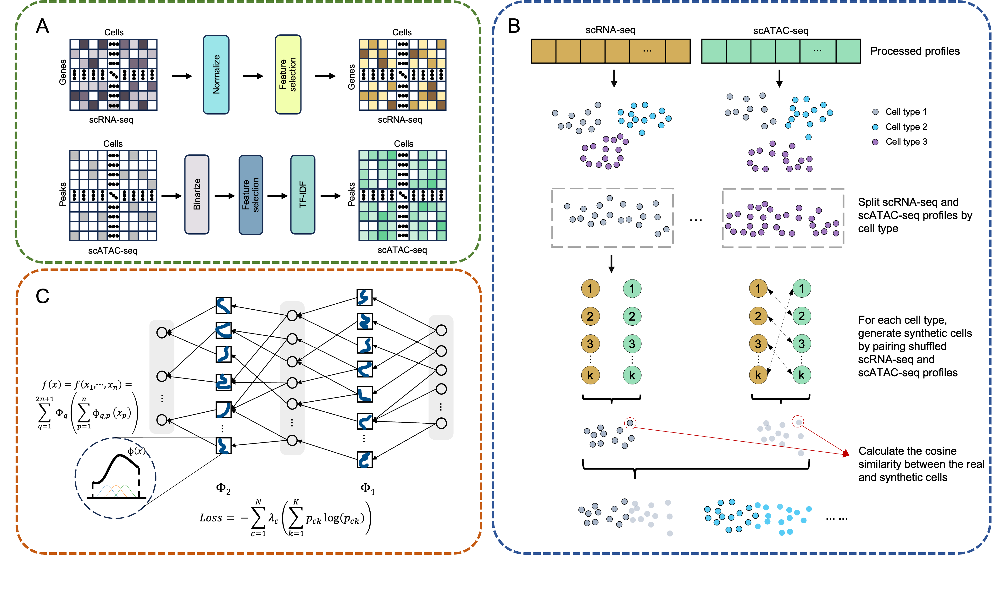

[](https://pypi.org/project/multikano)

[](https://pepy.tech/project/multikano)

# MultiKano: an automatic cell type annotation tool for single-cell multi-omics data based on Kolmogorov-Arnold network and data augmentation




## Installation
It's prefered to create a new environment for MultiKano:

```python
conda create -n MultiKano python==3.7
conda activate MultiKano
```

MultiKano is available on PyPI, and could be installed using:

```python
pip install MultiKano
```

Installation via Github is also provided

```python
git clone https://github.com/Biox-NKU/MultiKano
cd MultiKano
pip install multikano-0.1.0-py3-none-any.whl
```

This process will take approximately 5 to 10 minutes, depending on the user's computer device and internet connectivition.

## Quick Start

### Input:
**Train_set_RNA**: AnnData object of shape  `n_obs` × `n_vars` with `cell_type` labels. Rows correspond to cells and columns to genes. 

**Train_set_ATAC**: AnnData object of shape  `n_obs` × `n_vars` with `cell_type` labels. Rows correspond to cells and columns to peaks.

**Test_set_RNA**: AnnData object of shape  `n_obs` × `n_vars` without cell type labels. Rows correspond to cells and columns to genes. 

**Test_set_ATAC**: AnnData object of shape  `n_obs` × `n_vars` without cell type labels. Rows correspond to cells and columns to peaks.

**Note that Train_set_RNA and Train_set_ATAC should be paired, and the same applies to Test_set_RNA and Test_set_ATAC.**

### Output:
**Pred_labels**: Array object which contains cell type annotation results on the test set.

### Using tutorial:
```python
import multikano as multikano

Pred_labels = multikano.run_model(Train_set_RNA, Train_set_ATAC, Test_set_RNA, Test_set_ATAC)
```

